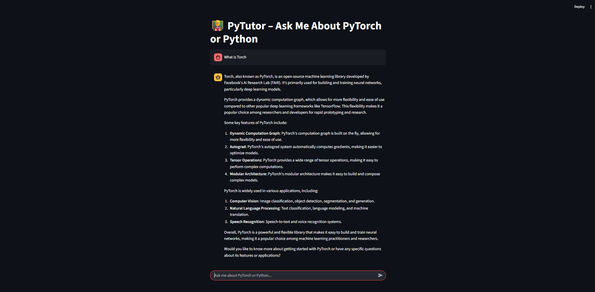

# PyTutor 🎓

**PyTutor** is an interactive Python learning platform aimed at helping students and developers learn Python programming through guided tutorials, hands-on exercises, and real-time code evaluation. Whether you're a beginner or brushing up your skills, PyTutor provides a structured and user-friendly environment to learn effectively.

---

## 🚀 Features

- 📘 Beginner to intermediate level Python and PyTorch tutorials
- 💻 Live code execution with feedback
- 🧪 Auto-evaluated coding exercises
- 📊 Learning progress tracking (optional)
- 🔐 Safe sandboxed code evaluation
- 🌐 Clean and responsive user interface

---

## 🏗️ Project Structure

```
PyTutor/
├── app/                    # Core application code
│   ├── __init__.py
│   ├── routes.py           # API / Web routes
│   ├── tutorials/          # Tutorials content
│   ├── evaluator/          # Code evaluator logic
│   └── utils/              # Utility modules
├── static/                 # CSS, JS, Images
├── templates/              # HTML templates
├── tests/                  # Unit & integration tests
├── requirements.txt        # Python dependencies
├── .env.example            # Environment config template
├── .gitignore              # Git ignored files
└── README.md               # Project documentation
```

---

## ⚙️ Getting Started

### 🔧 Prerequisites

- Python 3.8+
- pip (Python package installer)
- Git

### 📥 Clone and Setup

```bash
git clone https://github.com/27804balaji/PyTutor.git
cd PyTutor
python3 -m venv venv
source venv/bin/activate
pip install -r requirements.txt
```

> Optionally, copy the environment file:
```bash
cp .env.example .env
```

### ▶️ Run the Application

```bash
python app/main.py
```

Or if using Flask:

```bash
export FLASK_APP=app
flask run
```

---

## 🧪 Running Tests

```bash
pytest
```

---

## 🛠 Technologies

- Python 3.8+
- Flask / Jinja2 (or Django if applicable)
- HTML5 / CSS3 / JavaScript
- SQLite / PostgreSQL (if database is integrated)
- pytest (for testing)

---

## 📦 Environment Variables

| Variable       | Description                     |
|----------------|---------------------------------|
| `SECRET_KEY`   | Secret key for the application  |
| `DEBUG`        | Enable/Disable debug mode       |
| `DATABASE_URL` | (Optional) Database connection  |

---

## 📈 Future Enhancement

- [ ] Add user login/signup
- [ ] Gamify learning with XP and badges
- [ ] Add multi-language code support
- [ ] Docker and deployment setup
- [ ] Responsive mobile-first design

---

## 🤝 Contributing

1. Fork this repository
2. Create a new branch: `git checkout -b feature/my-feature`
3. Make your changes and commit: `git commit -m 'Add my feature'`
4. Push your branch: `git push origin feature/my-feature`
5. Open a Pull Request

---

## 📄 License

This project is licensed under the MIT License. See [`LICENSE`](LICENSE) for more information.

---

## 🙌 Acknowledgements

Thanks to all open-source contributors, Python educators, and the developer community that makes tools like this possible.

---

## 📬 Contact

**Author**: [Balaji Perumal](https://github.com/27804balaji)  
**Email**: 27804balaji@gmail.com

---

> _"Teaching Python is easy. Learning it is easier with PyTutor."_ 🐍
>
> ## 📸 Output Screenshot


